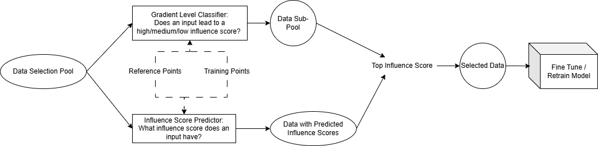

# Updated Instruction of Efficient Data Selection Pipelines for LLM Tuning

## Framework


**Implementation Notes**
1. Since the original valiation dataset for each task (dolly, flan-v2) is fairly small, I used them as reference points, and took part of the training dataset as training points for classification or regression. The rest of training data is seen as the data selection pool.

   For example, `dolly` has 15K samples, and I chose 7.5K as training points `val_dolly_data.jsonl` for classification or regression models, while the other 7.5K as the data selection pool `train_dolly_data.jsonl`. 

2. The influence score of a given data instance w.r.t a target task can be defined as the average/maximum/minimum cosine similarity between this sample and a set of reference points from the target task. So in [data_generation.ipynb](filter/data_generation.ipynb), there are three ways of aggregating cosine similarity as the final influence score of an input w.r.t reference points.

## 🔗 Quick Links
This repo contains the code for an ICML 2024  paper [LESS: Selecting Influential Data for Targeted Instruction Tuning](https://arxiv.org/abs/2402.04333). In this work, we propose a data selection method to select influential data to induce a target capability.
- [LESS: Selecting Influential Data for Targeted Instruction Tuning](#less-selecting-influential-data-for-targeted-instruction-tuning)
  - [🔗 Quick Links](#-quick-links)
  - [Install Requirements](#install-requirements)
  - [Data Preparation](#data-preparation)
  - [How to Run New Pipeline](#how-to-run-the-new-pipeline)
  - [Next Steps](#next-steps)
  - [LESS Selection Pipeline](#less-pipeline)
    - [Step 1: Warmup training](#step-1-warmup-training)
    - [Step 2: Building the gradient datastore](#step-2-building-the-gradient-datastore)
    - [Step 3: Selecting data for a task](#step-3-selecting-data-for-a-task)
    - [Step 4: Train with your selected data](#step-4-train-with-your-selected-data)
  - [Evaluation](#evaluation)
  - [Bugs or Questions?](#bugs-or-questions)
  - [Citation](#citation)


## Install Requirements
**Step 1**: To get started with this repository, you'll need to follow these installation steps. Before proceeding, make sure you have [Pytorch](https://pytorch.org/get-started/previous-versions/) installed. 
```
pip3 install torch==2.1.2 torchvision torchaudio
```

**Step 2**: Then install the rest of the required packages:
```
cd LESS
pip install -r requirement.txt
```

**Step 3**: Finally, install the `less` package in editable mode to make it accessible for your development environment:
```
pip install -e .
```


## Data Preparation
We follow the [open-instruct](https://github.com/allenai/open-instruct?tab=readme-ov-file#dataset-preparation) repo to prepare four instruction tuning datasets. In our project, we utilize a combination of four training datasets: Flan v2, COT, Dolly, and Open Assistant. For the purposes of evaluation, we employ three additional datasets: MMLU, Tydiqa, and BBH. A processed version of these files are available [here](https://huggingface.co/datasets/princeton-nlp/less_data).

**To use data disk, please follow these steps**
1. create a folder in the data disk by `mkdir /data/yourusername`
2. create a data folder in the user's home directory by `mkdir ~/my_project_data`, and link this folder with the data disk one by `ln -s /data/yourusername/my_project_data ~/my_project_data`

## How to Run the New Pipeline

1. run [split_dataset.ipynb](split_dataset.ipynb) to generate data selection pool `train_dolly_data.jsonl` and training points `val_dolly_data.jsonl` for classification/regression tasks. 
2. use [warm_up.sh](warm_up.sh) to obtain checkpoints of LORA training on part of the data selection pool.
3. run [fake_val_grad.sh](filter/scripts/fake_val_grad.sh) to calculate adam gradidents of sampled training points `sampled_val_dolly_data.jsonl`, and [val_grad.sh](val_grad.sh) to get SGD gradients of reference points. The reason to sample training points is only for testing the code and speed up code updates. 
4. use [data_generation.ipynb](filter/data_generation.ipynb) to obtain influence scores of training points and label data for classification tasks. 
5. use [run_filter.ipynb](filter/run_filter.ipynb) to apply classifier or regression models to predict gradient levels or influence scores of the data selection pool.  
6. after applying the classifier, run [train_grad.sh](filter/scripts/train_grad.sh) to get actual adam gradients of selection candidates classified as high-gradient levels. Then, use [inf_score.sh](filter/scripts/inf_score.sh) and [top_influence.sh](filter/scripts/top_influence.sh) to get influence scores of selected points. 
  
  However, there's no need to run these steps if the regression model is used to get promising data selection candidates. 

7. run [tune.sh](filter/scripts/tune.sh) to fine-tune a language model and test the model with [raw_eval.sh](evaluation/raw_eval.sh) after modifying parameters there. 

## Current Results

Use 3K training points and 280 reference points, and fix 0 as the random seed when creating dataloaders to train classification / regression models. 

Avg/Max/Min columns means if we take the average/max/min cosine similarities between a training point and 280 reference points as the influence score of this point about a target task.  

Projected Gradient Vector Dimension = 4096, defined in [fake_val_grad.sh](filter/scripts/fake_val_grad.sh)

| Metrics| Avg | Max | Min |
|----------|----------|----------|----------|
|   Classification Accuracy  |   41%   |   38%   |   42%   |
|   Regression R2 Score  |   -2.09   |   -14   |   -0.029   |


## Next Steps

- [ ] Better gradient level classifier / influence score predictor. Try more training epochs / data and so on. 

- [ ] Reproduce LESS experiment results. To load model and all datasets into our total GPU memory of ~ 50GB, model quantization *(In `less/train/train.py`, around lines 75-76, when creating the model, add a parameter  `load_in_8bit=True`)* and gradient checkpointing may need to be enabled *(In `less/scripts/train/base_training_args.sh`, simply add another parameter `--gradient_checkpointing`. The library version of Accelerate may need to be over 0.28.0, but other functions, like loading data or distributed training can be affected.)*

## LESS Pipeline

**Since several datasets and checkpoints are needed for either LESS experiment reproduction or running new pipelines, I created new bash files to make the process more convenient.**

### Step 1: Warmup training in [warmup.sh](warmup.sh)
To enhance downstream performance from data selection, it's crucial to start with a warmup training step. This involves selecting a small portion of your entire dataset to train using the LoRA method. Follow these steps for effective warmup training:

Original Bash:
```bash 
DATA_DIR=../data
MODEL_PATH=meta-llama/Llama-2-7b-hf
PERCENTAGE=0.05 # percentage of the full data to train, you can specify the training file you want to use in the script
DATA_SEED=3
JOB_NAME=llama2-7b-p${PERCENTAGE}-lora-seed${DATA_SEED}

./less/scripts/train/warmup_lora_train.sh "$DATA_DIR" "$MODEL_PATH" "$PERCENTAGE" "$DATA_SEED" "$JOB_NAME"
```

### Step 2: Building the gradient datastore in [train_grad.sh](train_grad.sh)
Once the initial warmup training stage is completed, we will collect gradients for the entire training dataset. For each checkpoint, our goal is to obtain the gradients of all the training data that we would like to select from. An example script is shown below.

Original Bash
```bash
CKPT=105

TRAINING_DATA_NAME=dolly
TRAINING_DATA_FILE=../data/train/processed/dolly/dolly_data.jsonl # when changing data name, change the data path accordingly
GRADIENT_TYPE="adam"
MODEL_PATH=../out/llama2-7b-p0.05-lora-seed3/checkpoint-${CKPT}
OUTPUT_PATH=../grads/llama2-7b-p0.05-lora-seed3/${TRAINING_DATA_NAME}-ckpt${CKPT}-${GRADIENT_TYPE}
DIMS="8192"

./less/scripts/get_info/get_train_lora_grads.sh "$TRAINING_DATA_FILE" "$MODEL_PATH" "$OUTPUT_PATH" "$DIMS" "$GRADIENT_TYPE"
```
Ideally, you would aim to create a datastore that encompasses a gradient of all the checkpoints and training data from which you wish to choose. 

### Step 3: Compute Validation Gradients [val_grad.sh](val_grad.sh), Obtain Influenc Score in [inf_score.sh](inf_score.sh) and then Select Data for a Task in [top_influence.sh](top_influence.sh)

To select data for a particular downstream task, it's necessary to first prepare data specific to that task, using the same instruction-tuning prompt format as was employed during training. We have set up data loading modules for three evaluation datasets featured in our work: BBH, TydiQA, and MMLU. If you're interested in data selection for additional tasks, you can expand the [`less/data_selection/get_validation_dataset.py`](less/data_selection/get_validation_dataset.py) script to accommodate those tasks. Similar to obtaining gradients for training data, run the following script. The primary difference is that this process will yield SGD gradients for the validation data, following the formulation of the influence estimation. 

Original Bash
```bash

CKPT=105
TASK=tydiqa
MODEL_PATH=../out/llama2-7b-p0.05-lora-seed3/checkpoint-${CKPT}
OUTPUT_PATH=../grads/llama2-7b-p0.05-lora-seed3/${TASK}-ckpt${CKPT}-sgd # for validation data, we always use sgd
DATA_DIR=../data
DIMS="4096 8192" # We use 8192 as our default projection dimension 

./less/scripts/get_info/get_eval_lora_grads.sh "$TASK" "$DATA_DIR" "$MODEL_PATH" $OUTPUT_PATH "$DIMS"
```
You should gain the gradients of the validation data for all the checkpoints you used for building the gradient datastore in the previous step. After obtaining the gradients for the validation data, we can then select data for the task. The following script will calculate the influence score for each training data point, and select the top-k data points with the highest influence score.

```bash
DIM=8192 # decide which dimension to use
GRADIENT_PATH=../grads/llama2-7b-p0.05-lora-seed3/{}-ckpt{}-adam/dim${DIM}
TRAIN_FILE_NAMES="flan_v2 cot dolly oasst1"
CKPTS="105 211 317 420" # checkpoing index
CHECKPOINT_WEIGHTS="1.6877e-05 1.2859e-05 7.7030e-06 2.5616e-06" # average lr of the epoch

VALIDATION_GRADIENT_PATH=../grads/llama2-7b-p0.05-lora-seed3/{}-ckpt{}-sgd/dim${DIM}
TARGET_TASK_NAMES="tydiqa"
SELECTED_DATA_OUTPUT_PATH="../selected_data"

./less/scripts/data_selection/matching.sh "$GRADIENT_PATH" "$TRAIN_FILE_NAMES" "$CKPTS" "$CHECKPOINT_WEIGHTS" "$VALIDATION_GRADIENT_PATH" "$TARGET_TASK_NAMES" "$SELECTED_DATA_OUTPUT_PATH"
```

The influence score for each training data point will be saved in the `OUTPUT_PATH` directory. You can use the following script to select the top-k data points with the highest influence score. 

```bash
python3 -m less.data_selection.write_selected_data \
--target_task_names ${TARGET_TASK_NAMES} \
--train_file_names ${TRAIN_FILE_NAMES} \
--train_files ../data/train/processed/dolly/dolly_data.jsonl ../data/train/processed/oasst1/oasst1_data.jsonl \
--output_path $SELECTED_DATA_OUTPUT_PATH \
--percentage 0.05
```

### Step 4: Train with your selected data in [tune.sh](tune.sh)
After selecting the data, you can use the following script to train the model with the selected data. 

```bash 
TARGET_TASK_NAME="tydiqa"
PERCENTAGE=0.05
TRAIN_FILES=../selected_data/${TARGET_TASK_NAME}/top_p${PERCENTAGE}.jsonl
MODEL_PATH=meta-llama/Llama-2-7b-hf
JOB_NAME=llama2-7b-less-p${PERCENTAGE}-lora

./less/scripts/train/lora_train.sh "$TRAIN_FILES" "$MODEL_PATH" "$JOB_NAME" 
```
Note that you can also perform full-parameter finetuning by removing the lora training parameters. 

## Evaluation

**I haven't figured out how to run the following scripts, so I created a simple one in [raw_eval.sh](evaluation/raw_eval.sh) where arguments need to be modified.**

Please follow the instructions in the [evaluation](evaluation/README.md) folder to evaluate the performance of the model trained on the selected data.

## Bugs or Questions?

new pipeline builder: e-well@outlook.com
original: mengzhou@princeton.edu and LESS repo
<!-- If you have any questions related to the code or the paper, feel free to email Mengzhou (mengzhou@princeton.edu). If you encounter any problems when using the code, or want to report a bug, you can open an issue. Please try to specify the problem with details so we can help you better and quicker! -->

## Citation
Please cite our paper if you find the repo helpful in your work:

```bibtex
@inproceedings{xia2024less,
   title={{LESS}: Selecting Influential Data for Targeted Instruction Tuning},
   author={Xia, Mengzhou and Malladi, Sadhika and Gururangan, Suchin and Arora, Sanjeev and Chen, Danqi},
   booktitle={International Conference on Machine Learning (ICML)},
   year={2024}
}
```


